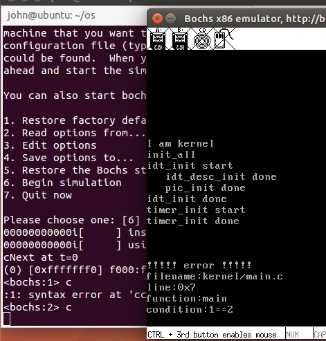

# 断言函数assert

一种是为内核系统使用的 ASSERT，另一种是为用户进程使用的assert

一方面，当内核运行中出现问题时，多属于严重的错误，着实没必要再运行下去了。另一方面，断言在输出报错信息时，屏幕输出不应该被其他进程干扰，这样咱们才能专注于报错信息。综上两点原因，ASSERT 排查出错误后，最好在关中断的情况下打印报错信息 。

ASSERT 是用来辅助程序调试的，所以通常是用在开发阶段。如果程序中的某些地方会莫名其妙地出错，而我们又无法短时间内将其排查出来，这时我们可以在程序中安排个“哨兵”，这个哨兵就是 ASSERT。我们把程序该有的条件状态传给它，让它帮咱们监督此条件，一旦条件不符合就会报错井将程序挂起。

```cpp
ASSERT （条件表达式｝ ；
```

* debug.h，定义ASSERT函数

```cpp
#ifndef __KERNEL_DEBUG_H
#define __KERNEL_DEBUG_H
void panic_spin(char* filename, int line, const char* func, const char* condition);

/***************************  __VA_ARGS__  *******************************
 * __VA_ARGS__ 是预处理器所支持的专用标识符。
 * 代表所有与省略号相对应的参数. 
 * "..."表示定义的宏其参数可变.*/
#define PANIC(...) panic_spin (__FILE__, __LINE__, __func__, __VA_ARGS__)
 /***********************************************************************/

#ifdef NDEBUG
   #define ASSERT(CONDITION) ((void)0)
#else
   #define ASSERT(CONDITION)                                      \
      if (CONDITION) {} else {                                    \
  /* 符号#让编译器将宏的参数转化为字符串字面量 */		  \
	 PANIC(#CONDITION);                                       \
      }
#endif /*__NDEBUG */

#endif /*__KERNEL_DEBUG_H*/
```

* debug.c

```cpp
#include "debug.h"
#include "print.h"
#include "interrupt.h"

/* 打印文件名,行号,函数名,条件并使程序悬停 */
void panic_spin(char* filename,	       \
	        int line,	       \
		const char* func,      \
		const char* condition) \
{
   intr_disable();	// 因为有时候会单独调用panic_spin,所以在此处关中断。
   put_str("\n\n\n!!!!! error !!!!!\n");
   put_str("filename:");put_str(filename);put_str("\n");
   put_str("line:0x");put_int(line);put_str("\n");
   put_str("function:");put_str((char*)func);put_str("\n");
   put_str("condition:");put_str((char*)condition);put_str("\n");
   while(1);
}
```

* main.c

```cpp
#include "print.h"
#include "init.h"
#include "debug.h"
int main(void) {
   put_str("I am kernel\n");
   init_all();
   ASSERT(1==2);
   while(1);
   return 0;
}
```

* 运行截图


