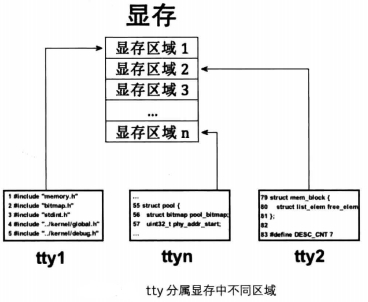
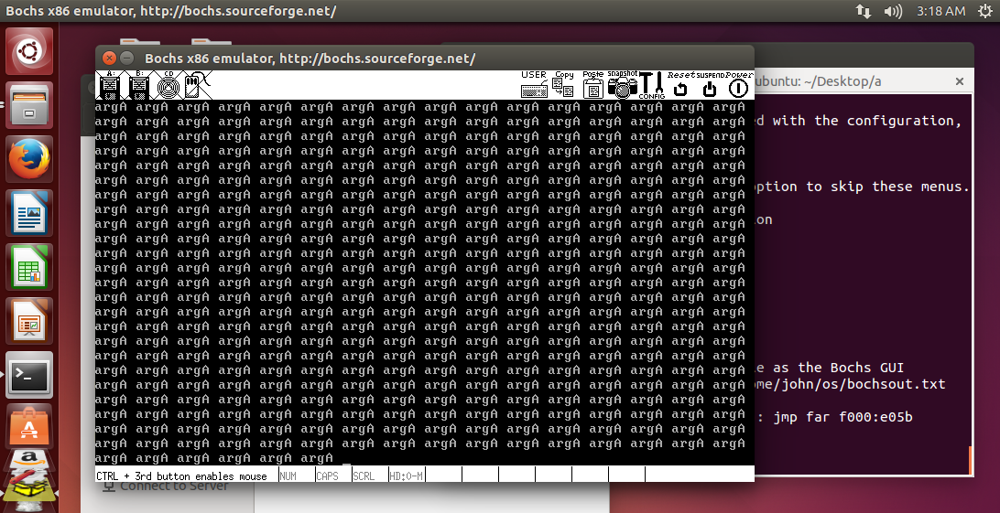
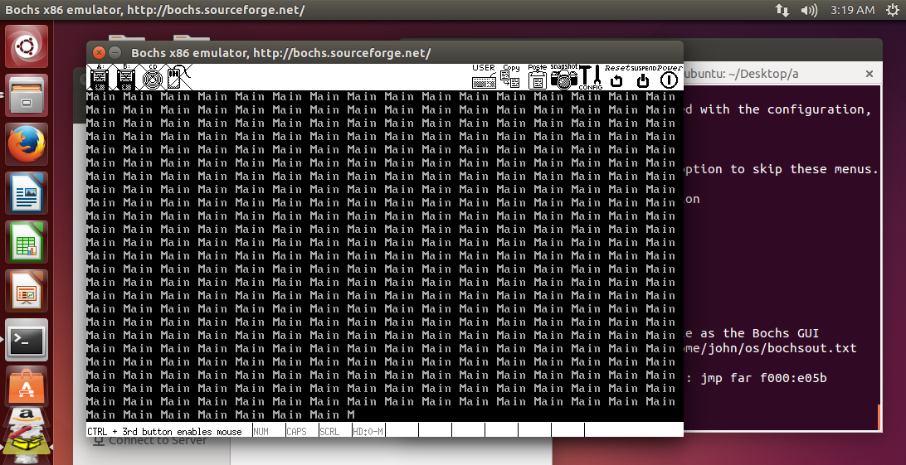

# 解决多线程竞争

临界区，互斥，信号量，锁等

## 临界区，竞争条件，互斥

* 公共资源

可以是公共内存、公共文件、公共硬件等，总之是被所有任务共享的一套资源。

* 临界区

程序要想使用某些资源，必然通过一些指令去访问这些资源，若多个任务都访问同一公共资源，那么各任务中访问公共资源的指令代码组成的区域就称为临界区。怕有同学看得不仔细，强调一下，临界区是指程序中那些访问公共资源的指令代码，即临界区是指令，并不是受访的静态公共资源。

* 互斥

互斥也可称为排他，是指某一时刻公共资源只能被 1 个任务独享，即不允许多个任务同时出现在自己的临界区中。公共资源在任意时刻只能被一个任务访问，即只能有一个任务在自己的临界区中执行，其他任务想访问公共资源时，必须等待当前公共资源的访问者完全执行完他自己的临界区代码后（使用完资源后）再开始访问。

* 竞争条件

竞争条件是指多个任务以非互斥的方式同时进入临界区，大家对公共资源的访问是以竞争的方式并行进行的，因此公共资源的最终状态依赖于这些任务的临界区中的微操作执行次序。

当多个任务“同时”读写公共资源时，也就是多个任务“同时”执行它们各自临界区中的代码时，它们以混杂井行的方式访问同一资源，因此后面任务会将前一任务的结果覆盖，最终公共资源的结果取决于所有任务的执行时序。这里所说的“同时”也可以指多任务伪并行，总之是指一个任务在自己的临界区中读写公共资源，还没来得及出来（彻底执行完临界区所有代码），另一小任务也进入了它自己的临界区去访问同一资源。

## 分析上一小结的线程竞争问题

* 线程 k_tbread a、 k_tbread_b 和主线程

* 每个线程都调用 put_char 函数来打印字符， put_char的功能是访问公共资源显存及光标寄存器

临界区 put_char 中的指令不是一条，而是很多；因此对公共资源的访问无法一下子执行彻底。当多个线程都在临界区时，受访的资源是同一个，加之多个线程又是伪井行，后面进入临界区的线程必然会覆盖前面所有线程的成果，再者，即使多个线程是真并行执行，对于访问共享资源也会有个前后顺序，因此显存和光标寄存器这两个公共资源的状态取决于所有线程的访问时序

多线程访问公共资源时出问题的原因是产生了竞争条件，也就是多个任务同时出现在自己的临界区 。 为避免产生竞争条件，必须保证任意时刻只能有一个任务处于临界区 。 因此，只要保证各线程自己临界区中的所有代码都是原子操作，即临界区中的指令要么一条不做，要么一气呵成全部执行完，执行期间绝对不能被换下处理器

## 信号量

* 同步

同步一般是指合作单位之间为协作完成某项工作而共同遵守的工作步调，强调的是配合时序，就像十字路口的红绿灯，只有在绿灯亮起的情况下司机才能踩油门把车往前开，这就是一种同步， 绿灯不亮就开车的话容易引起交通事故，这就是在十字路口这种事故多发地带用红绿汀同步交通的目的。 同步简单来说就是不能随时随意工作，工作必须在某种条件具备的情况下才能开始，工作条件具备的时间顺序就是时序。

* 线程同步

线程同步的目的是不管线程如何混杂、穿插地执行，都不会影响结果的正确在丁 线程不像人那样有判断“配合时序”的意识，它的执行会很随意，这就使合作出错成为必然 σ 因此，当多个线程访问同一公共资源时（当然这也属于线程合作〉，为了保证结果正确，必然要用一套额外的机制来控制它们的工作步调，也就是使线程们同步工作。

* 信号量，PV操作。

增加操作 up 包括两个微操作
   1. 将信号量的值加 l
   2. 唤醒在此信号量上等待的线程

减少操作 down 包括三个子操作
   1. 判断信号量是否大于 0
   2. 若信号量大于 0 ，则将信号量减 1
   3. 若信号量等于 0 ，当前线程将自己阻塞，以在此信号量上等待

信号量的初值代表是信号资源的累积量，也就是剩余量，若初值为 1 的话，它的取值就只能为 0 和 1,这便称为二元信号量，我们可以利用二元信号量来实现锁 。

阻塞是线程自己发出的动作，也就是线程自己阻塞自己，并不是被别人阻塞的，阻塞是线程主动的行为 。 己阻塞的钱程是由别人来唤醒的，唤醒是被动的。

* 线程阻塞

```cpp
/* 当前线程将自己阻塞,标志其状态为stat. */
void thread_block(enum task_status stat) {
/* stat取值为TASK_BLOCKED,TASK_WAITING,TASK_HANGING,也就是只有这三种状态才不会被调度*/
   ASSERT(((stat == TASK_BLOCKED) || (stat == TASK_WAITING) || (stat == TASK_HANGING)));
   enum intr_status old_status = intr_disable();
   struct task_struct* cur_thread = running_thread();
   cur_thread->status = stat; // 置其状态为stat 
   schedule();		      // 将当前线程换下处理器
/* 待当前线程被解除阻塞后才继续运行下面的intr_set_status */
   intr_set_status(old_status);
}
```

* 线程唤醒

```cpp
/* 将线程pthread解除阻塞 */
void thread_unblock(struct task_struct* pthread) {
   enum intr_status old_status = intr_disable();
   ASSERT(((pthread->status == TASK_BLOCKED) || (pthread->status == TASK_WAITING) || (pthread->status == TASK_HANGING)));
   if (pthread->status != TASK_READY) {
      ASSERT(!elem_find(&thread_ready_list, &pthread->general_tag));
      if (elem_find(&thread_ready_list, &pthread->general_tag)) {
	      PANIC("thread_unblock: blocked thread in ready_list\n");
      }
      list_push(&thread_ready_list, &pthread->general_tag);    // 放到队列的最前面,使其尽快得到调度
      pthread->status = TASK_READY;
   }
   intr_set_status(old_status);
}
```

* 实现信号量

```cpp
/* 信号量结构 */
struct semaphore {
   uint8_t  value;
   struct   list waiters;
};

/* 锁结构 */
struct lock {
   struct   task_struct* holder;	    // 锁的持有者
   struct   semaphore semaphore;	    // 用二元信号量实现锁
   uint32_t holder_repeat_nr;		    // 锁的持有者重复申请锁的次数
};
```

* 初始信号量,锁

```cpp
/* 初始化信号量 */
void sema_init(struct semaphore* psema, uint8_t value) {
   psema->value = value;       // 为信号量赋初值
   list_init(&psema->waiters); //初始化信号量的等待队列
}

/* 初始化锁plock */
void lock_init(struct lock* plock) {
   plock->holder = NULL;
   plock->holder_repeat_nr = 0;
   sema_init(&plock->semaphore, 1);  // 信号量初值为1
}
```

* 信号PV，锁的获取释放(利用中断)

```cpp
/* 信号量down操作 */
void sema_down(struct semaphore* psema) {
   /* 关中断来保证原子操作 */
   enum intr_status old_status = intr_disable();
   while(psema->value == 0) { // 若value为0,表示已经被别人持有
      ASSERT(!elem_find(&psema->waiters, &running_thread()->general_tag));
      /* 当前线程不应该已在信号量的waiters队列中 */
      if (elem_find(&psema->waiters, &running_thread()->general_tag)) {
	      PANIC("sema_down: thread blocked has been in waiters_list\n");
      }
   /* 若信号量的值等于0,则当前线程把自己加入该锁的等待队列,然后阻塞自己 */
      list_append(&psema->waiters, &running_thread()->general_tag);
      thread_block(TASK_BLOCKED);    // 阻塞线程,直到被唤醒
   }
   /* 若value为1或被唤醒后,会执行下面的代码,也就是获得了锁。*/
   psema->value--;
   ASSERT(psema->value == 0);
   /* 恢复之前的中断状态 */
   intr_set_status(old_status);
}

/* 信号量的up操作 */
void sema_up(struct semaphore* psema) {
   /* 关中断,保证原子操作 */
   enum intr_status old_status = intr_disable();
   ASSERT(psema->value == 0);
   if (!list_empty(&psema->waiters)) {
      struct task_struct* thread_blocked = elem2entry(struct task_struct, general_tag, list_pop(&psema->waiters));
      thread_unblock(thread_blocked);
   }
   psema->value++;
   ASSERT(psema->value == 1);
   /* 恢复之前的中断状态 */
   intr_set_status(old_status);
}

/* 获取锁plock */
void lock_acquire(struct lock* plock) {
/* 排除曾经自己已经持有锁但还未将其释放的情况。*/
   if (plock->holder != running_thread()) { 
      sema_down(&plock->semaphore);    // 对信号量P操作,原子操作
      plock->holder = running_thread();
      ASSERT(plock->holder_repeat_nr == 0);
      plock->holder_repeat_nr = 1;
   } else {
      plock->holder_repeat_nr++;
   }
}

/* 释放锁plock */
void lock_release(struct lock* plock) {
   ASSERT(plock->holder == running_thread());
   if (plock->holder_repeat_nr > 1) {
      plock->holder_repeat_nr--;
      return;
   }
   ASSERT(plock->holder_repeat_nr == 1);

   plock->holder = NULL;	   // 把锁的持有者置空放在V操作之前
   plock->holder_repeat_nr = 0;
   sema_up(&plock->semaphore);	   // 信号量的V操作,也是原子操作
}
```

### 利用锁实现终端多线程正常输出

* 虚拟终端

虚拟终端就是我们熟知的町，据说 tty 原指电传打字机，即 TeleTYpes，它是一种用打字机键盘通过串行线发送和接收信息的设备，后来被键盘和显示器取代了，因此称为 tty 翻译为终端更合适。我们登录系统后，就会在后台运行一个 tty 进程



现在咱们操作 Linux，都是通过 ssh 远程连上去，除了去机房外，很少有直接在机器上登录系统的 。 包括我自己装虚拟机的时候，都是另装个 ssh 工具连接到虚拟机，习惯了 ssh 客户端的便利。顺便说一下，这种从远程连接到 Linux 主机的终端称为pts(linux who命令可以查看)

* 互斥的实现控制台输出

```cpp
static struct lock console_lock;    // 控制台锁

/* 初始化终端 */
void console_init() {
  lock_init(&console_lock);
}

/* 获取终端 */
void console_acquire() {
   lock_acquire(&console_lock);
}

/* 释放终端 */
void console_release() {
   lock_release(&console_lock);
}

/* 终端中输出字符串 */
void console_put_str(char* str) {
   console_acquire();
   put_str(str);
   console_release();
}

/* 终端中输出字符 */
void console_put_char(uint8_t char_asci) {
   console_acquire();
   put_char(char_asci);
   console_release();
}

/* 终端中输出16进制整数 */
void console_put_int(uint32_t num) {
   console_acquire();
   put_int(num);
   console_release();
}
```

文件中定义的 console_lock 是终端锁，对终端的所操作都是围绕申请这个锁展开的。它必须是全局
唯一的，因此类型是静态 static。

```cpp
/*负责初始化所有模块 */
void init_all() {
   put_str("init_all\n");
   idt_init();    // 初始化中断
   mem_init();	  // 初始化内存管理系统
   thread_init();  // 初始化线程相关结构
   timer_init();  // 初始化PIT
   console_init(); //控制台初始化最好放在开中断之前
}
```

#### 编写主函数验证

* main.c

```cpp
void k_thread_a(void*);
void k_thread_b(void*);

int main(void) {
   put_str("I am kernel\n");
   init_all();

   thread_start("k_thread_a", 31, k_thread_a, "argA ");
   thread_start("k_thread_b", 8, k_thread_b, "argB ");

   intr_enable();
   while(1) {
      console_put_str("Main ");
   };
   return 0;
}

/* 在线程中运行的函数 */
void k_thread_a(void* arg) {
/* 用void*来通用表示参数,被调用的函数知道自己需要什么类型的参数,自己转换再用 */
   char* para = arg;
   while(1) {
      console_put_str(para);
   }
}

/* 在线程中运行的函数 */
void k_thread_b(void* arg) {
/* 用void*来通用表示参数,被调用的函数知道自己需要什么类型的参数,自己转换再用 */
   char* para = arg;
   while(1) {
      console_put_str(para);
   }
}
```





将不再报错，打印结果也是很整齐的打印的
