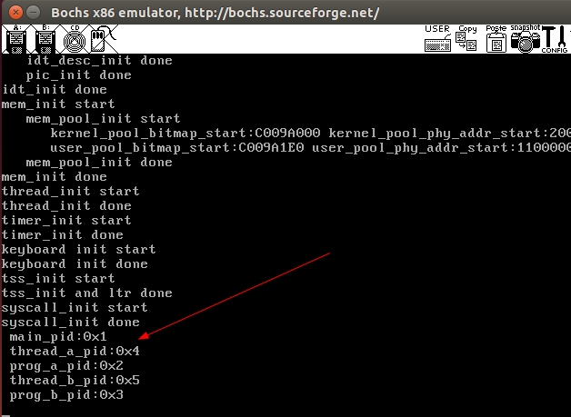
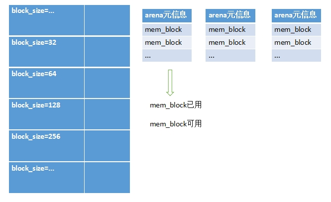
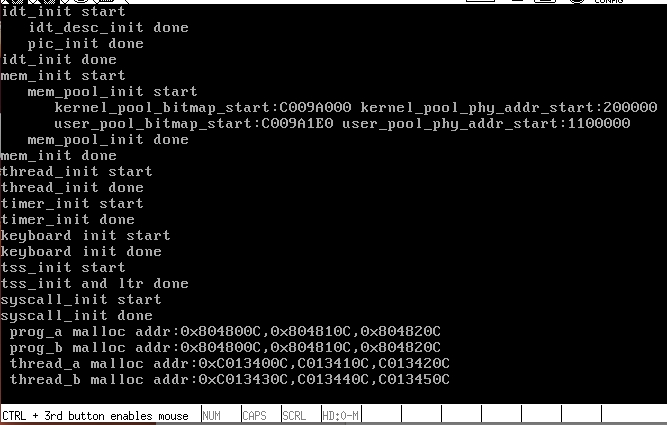

# 系统调用

* 系统调用由操作系统核心提供，运行于核心态，而普通的函数调用由函数库或用户自己提供，运行于用户态

* 系统调用在用户空间进程和硬件设备之间添加了一个中间层
   1. 它为用户空间提供了一种统一的硬件的抽象接口
   2. 系统调用保证了系统的稳定和安全。作为硬件设备和应用程序之间的中间人，内核可以基于权限和其他一些规则对需要进行的访问进行裁决。举例来说，这样可以避免应用程序不正确地使用硬件设备，窃取其他进程的资源，或做出其他什么危害系统的事情。
   3. 在Linux中，系统调用是用户空间访问内核的惟一手段；除异常和中断外，它们是内核惟一的合法入口。

* 用户空间的程序无法直接执行内核代码。如果果进程可以直接在内核的地址空间上读写的话，系统安全就会失去控制。所以，应用程序应该以某种方式通知系统，告诉内核自己需要执行一个系统调用，希望系统切换到内核态，这样内核就可以代表应用程序来执行该系统调用了。通知内核的机制是靠软件**中断**实现的。

参考博文：http://blog.csdn.net/zhuxiaoping54532/article/details/51700576

## 用户进程pid实现

* 进程结构体重新增pid成员变量

* pid采用静态全局变量，锁控制+1,确保唯一

* 进程初始化是就分配好pid

* 为进程添加系统调用getpid系统调用接口

代码见`16_system\code\pro_getpid`

主函数

```cpp
int main(void) {
   put_str("I am kernel\n");
   init_all();

   process_execute(u_prog_a, "user_prog_a");
   process_execute(u_prog_b, "user_prog_b");

   intr_enable();
   console_put_str(" main_pid:0x");
   console_put_int(sys_getpid());
   console_put_char('\n');
   thread_start("k_thread_a", 31, k_thread_a, "argA ");
   thread_start("k_thread_b", 31, k_thread_b, "argB ");
   while(1);
   return 0;
}

/* 在线程中运行的函数 */
void k_thread_a(void* arg) {
   char* para = arg;
   console_put_str(" thread_a_pid:0x");
   console_put_int(sys_getpid());
   console_put_char('\n');
   console_put_str(" prog_a_pid:0x");
   console_put_int(prog_a_pid);
   console_put_char('\n');
   while(1);
}

/* 在线程中运行的函数 */
void k_thread_b(void* arg) {
   char* para = arg;
   console_put_str(" thread_b_pid:0x");
   console_put_int(sys_getpid());
   console_put_char('\n');
   console_put_str(" prog_b_pid:0x");
   console_put_int(prog_b_pid);
   console_put_char('\n');
   while(1);
}

/* 测试用户进程 */
void u_prog_a(void) {
   prog_a_pid = getpid();
   while(1);
}

/* 测试用户进程 */
void u_prog_b(void) {
   prog_b_pid = getpid();
   while(1);
}
```

运行截图



## 系统调用内存管理

### arena数据结构（将一大块内存划分成多个小内存块，每个小内存块之间互不干涉）

* 元信息：

描述自己内存池中的空闲内存块数量，包括内存块描述符指针

大小估计，约为12字节

* 粒度较小的内存小块（mem_block）

用于内存分配

一个arena提供的内存空间大小是有限的，当一个arena用完了，就需要一个新的arena(arena集群)

同一类内存块可以用多个arena提供，每一个类内存块可以建立聂村块描述符（块大小，arena链表)

```cpp
/* 内存块 */
struct mem_block {
   struct list_elem free_elem;
};

/* 内存块描述符 */
struct mem_block_desc {
   uint32_t block_size;		 // 内存块大小
   uint32_t blocks_per_arena;	 // 本arena中可容纳此mem_block的数量.
   struct list free_list;	 // 目前可用的mem_block链表
};

/* 内存仓库arena元信息 */
struct arena {
   struct mem_block_desc* desc;	 // 此arena关联的mem_block_desc
/* large为ture时,cnt表示的是页框数。
 * 否则cnt表示空闲mem_block数量 */
   uint32_t cnt;
   bool large;		   
};
```



### 实现：sys_malloc, sys_free, malloc, free

代码见 16_system\code\pro_malloc_free

```cpp
void k_thread_a(void*);
void k_thread_b(void*);
void u_prog_a(void);
void u_prog_b(void);

int main(void) {
   put_str("I am kernel\n");
   init_all();
   intr_enable();
   process_execute(u_prog_a, "u_prog_a");
   process_execute(u_prog_b, "u_prog_b");
   thread_start("k_thread_a", 31, k_thread_a, "I am thread_a");
   thread_start("k_thread_b", 31, k_thread_b, "I am thread_b");
   while(1);
   return 0;
}

/* 在线程中运行的函数 */
void k_thread_a(void* arg) {     
   void* addr1 = sys_malloc(256);
   void* addr2 = sys_malloc(255);
   void* addr3 = sys_malloc(254);
   console_put_str(" thread_a malloc addr:0x");
   console_put_int((int)addr1);
   console_put_char(',');
   console_put_int((int)addr2);
   console_put_char(',');
   console_put_int((int)addr3);
   console_put_char('\n');

   int cpu_delay = 100000;
   while(cpu_delay-- > 0);
   sys_free(addr1);
   sys_free(addr2);
   sys_free(addr3);
   while(1);
}

/* 在线程中运行的函数 */
void k_thread_b(void* arg) {     
   void* addr1 = sys_malloc(256);
   void* addr2 = sys_malloc(255);
   void* addr3 = sys_malloc(254);
   console_put_str(" thread_b malloc addr:0x");
   console_put_int((int)addr1);
   console_put_char(',');
   console_put_int((int)addr2);
   console_put_char(',');
   console_put_int((int)addr3);
   console_put_char('\n');

   int cpu_delay = 100000;
   while(cpu_delay-- > 0);
   sys_free(addr1);
   sys_free(addr2);
   sys_free(addr3);
   while(1);
}

/* 测试用户进程 */
void u_prog_a(void) {
   void* addr1 = malloc(256);
   void* addr2 = malloc(255);
   void* addr3 = malloc(254);
   printf(" prog_a malloc addr:0x%x,0x%x,0x%x\n", (int)addr1, (int)addr2, (int)addr3);

   int cpu_delay = 100000;
   while(cpu_delay-- > 0);
   free(addr1);
   free(addr2);
   free(addr3);
   while(1);
}

/* 测试用户进程 */
void u_prog_b(void) {
   void* addr1 = malloc(256);
   void* addr2 = malloc(255);
   void* addr3 = malloc(254);
   printf(" prog_b malloc addr:0x%x,0x%x,0x%x\n", (int)addr1, (int)addr2, (int)addr3);

   int cpu_delay = 100000;
   while(cpu_delay-- > 0);
   free(addr1);
   free(addr2);
   free(addr3);
   while(1);
}
```


