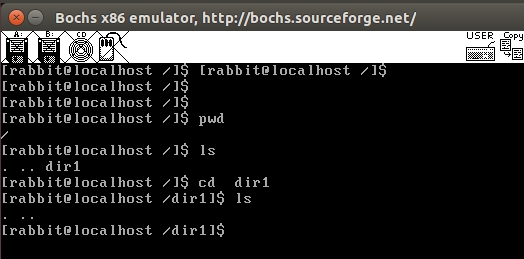

# fork

fork用老进程克隆出一个新进程并使新进程执行： fork先复制进程资源，然后跳过去执行

fork复制的内容：

* 进程PCB，即task_struct

一般PCB包括如下：

（1）进程标识符（内部，外部）

（2）处理机的信息（通用寄存器，指令计数器，PSW，用户的栈指针）。

（3）进程调度信息（进程状态，进程的优先级，进程调度所需的其它信息，事件）

（4）进程控制信息（程序的数据的地址，资源清单，进程同步和通信机制，链接指针）

* 程序体，即代码段，数据段等，这是进程的实体

* 用户栈，编译器会把局部变量在栈中创建，并且函数调用也需要栈

* 内核栈，进入内核态时，一方面用来保存上下文环境，另一方面同用户栈

* 虚拟地址池，每个进程拥有独立的内存空间，其虚拟地址是用虚拟地址池来管理的

* 页表，让进程拥有独立的内存空间

复制出来的进程需要加入到就绪队列中。

# read系统调用,putchar(输出一个字符), clear(清屏）

实现系统的交互，需要首先获取键盘的输入，然后分析，进而采取相应的行动。

```
/* 从文件描述符fd指向的文件中读取count个字节到buf,若成功则返回读出的字节数,到文件尾则返回-1 */
int32_t sys_read(int32_t fd, void* buf, uint32_t count) {
   ASSERT(buf != NULL);
   int32_t ret = -1;
   if (fd < 0 || fd == stdout_no || fd == stderr_no) {
      printk("sys_read: fd error\n");
   } else if (fd == stdin_no) {
      char* buffer = buf;
      uint32_t bytes_read = 0;
      while (bytes_read < count) {
	 *buffer = ioq_getchar(&kbd_buf);
	 bytes_read++;
	 buffer++;
      }
      ret = (bytes_read == 0 ? -1 : (int32_t)bytes_read);
   } else {
      uint32_t _fd = fd_local2global(fd);
      ret = file_read(&file_table[_fd], buf, count);   
   }
   return ret;
}
```

标准输入stdin, 然后不断的获取键盘输入缓冲区的内容

putchar, clear都能通过操作显存实现，可以直接采用汇编，操作相应的屏幕相关的内存地址

# 简单的shel -- 获取键盘输入

读入键盘缓冲区的内容

```
/* 从键盘缓冲区中最多读入count个字节到buf。*/
static void readline(char* buf, int32_t count) {
   assert(buf != NULL && count > 0);
   char* pos = buf;

   while (read(stdin_no, pos, 1) != -1 && (pos - buf) < count) { // 在不出错情况下,直到找到回车符才返回
      switch (*pos) {
       /* 找到回车或换行符后认为键入的命令结束,直接返回 */
	 case '\n':
	 case '\r':
	    *pos = 0;	   // 添加cmd_line的终止字符0
	    putchar('\n');
	    return;

	 case '\b':
	    if (cmd_line[0] != '\b') {		// 阻止删除非本次输入的信息
	       --pos;	   // 退回到缓冲区cmd_line中上一个字符
	       putchar('\b');
	    }
	    break;

	 /* ctrl+l 清屏 */
	 case 'l' - 'a': 
	    /* 1 先将当前的字符'l'-'a'置为0 */
	    *pos = 0;
	    /* 2 再将屏幕清空 */
	    clear();
	    /* 3 打印提示符 */
	    print_prompt();
	    /* 4 将之前键入的内容再次打印 */
	    printf("%s", buf);
	    break;

	 /* ctrl+u 清掉输入 */
	 case 'u' - 'a':
	    while (buf != pos) {
	       putchar('\b');
	       *(pos--) = 0;
	    }
	    break;

	 /* 非控制键则输出字符 */
	 default:
	    putchar(*pos);
	    pos++;
      }
   }
   printf("readline: can`t find enter_key in the cmd_line, max num of char is 128\n");
}

/* 简单的shell */
void my_shell(void) {
   cwd_cache[0] = '/';
   while (1) {
      print_prompt(); 
      memset(cmd_line, 0, cmd_len);
      readline(cmd_line, cmd_len);
      if (cmd_line[0] == 0) {	 // 若只键入了一个回车
	 continue;
      }
   }
   panic("my_shell: should not be here");
}


```


# 简单的shel -- 解析键盘输入

就是识别命令，如下面的，需要根据具体命令判断参数个数，类型之类的
```
ls
ls - l
pwd
cd dir1
```

也需要实现解析路径(绝对路径和相对路径)

# shell实现ls, cd ,mkdir，pwd等命令(代码见pro_02)

例如pwd命令的实现

```
/* pwd命令的内建函数 */
void buildin_pwd(uint32_t argc, char** argv UNUSED) {
   if (argc != 1) {
      printf("pwd: no argument support!\n");
      return;
   } else {
      if (NULL != getcwd(final_path, MAX_PATH_LEN)) {
	 printf("%s\n", final_path); 
      } else {
	 printf("pwd: get current work directory failed.\n");
      }
   }
}
```

```
 char* argv[MAX_ARG_NR];    // argv为全局变量，为了以后exec的程序可访问参数
int32_t argc = -1;
/* 简单的shell */
void my_shell(void) {
   cwd_cache[0] = '/';
   while (1) {
      print_prompt(); 
      memset(final_path, 0, MAX_PATH_LEN);
      memset(cmd_line, 0, MAX_PATH_LEN);
      readline(cmd_line, MAX_PATH_LEN);
      if (cmd_line[0] == 0) {	 // 若只键入了一个回车
	 continue;
      }
      argc = -1;
      argc = cmd_parse(cmd_line, argv, ' ');
      if (argc == -1) {
	 printf("num of arguments exceed %d\n", MAX_ARG_NR);
	 continue;
      }
      if (!strcmp("ls", argv[0])) {
	 buildin_ls(argc, argv);
      } else if (!strcmp("cd", argv[0])) {
	 if (buildin_cd(argc, argv) != NULL) {
	    memset(cwd_cache, 0, MAX_PATH_LEN);
	    strcpy(cwd_cache, final_path);
	 }
      } else if (!strcmp("pwd", argv[0])) {
	 buildin_pwd(argc, argv);
      } else if (!strcmp("ps", argv[0])) {
	 buildin_ps(argc, argv);
      } else if (!strcmp("clear", argv[0])) {
	 buildin_clear(argc, argv);
      } else if (!strcmp("mkdir", argv[0])){
	 buildin_mkdir(argc, argv);
      } else if (!strcmp("rmdir", argv[0])){
	 buildin_rmdir(argc, argv);
      } else if (!strcmp("rm", argv[0])) {
	 buildin_rm(argc, argv);
      } else {
	 printf("external command\n");
      }
   }
   panic("my_shell: should not be here");
}

```



---